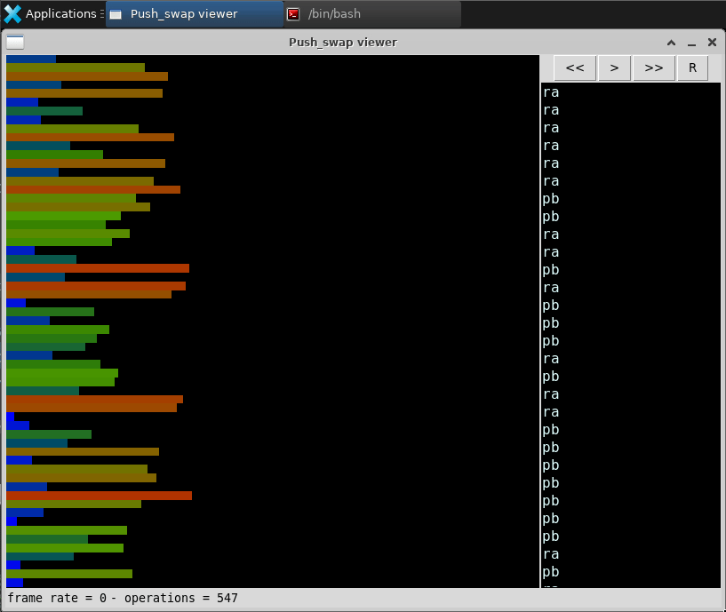

<div align="center">
	<div style="margin-bottom:3%">
		<a href="https://www.42sp.org.br/">
			
		</a>
	</div>
	<div>
		
		
		
	</div>
		<div>
		<a href="https://www.linkedin.com/in/gabriela-sertori-50b390189/">
			
		</a>
		<a href="https://www.linkedin.com/in/lucas-k-a555bb199/">
			
		</a>
	</div>
	<div>
			<a href="https://github.com/gabrielasertori">
			
		</a>
		<a href="https://github.com/KrebsCoder">
			
		</a>
	</div>
</div>

# Push_swap

This project involves sorting data on a stack, with a limited set of instructions, and the smallest number of moves. To make this happen, we chose bubble sort and radix sort.

---

<div>
	<p>Using <a href="https://github.com/o-reo/push_swap_visualizer">push_swap_visualizer</a> we can visually see how the sorting works! :smile:</p>
	
</div>

---
## Dependencies

<a href="https://www.gnu.org/software/make/">Make</a><br>
<a href="https://gcc.gnu.org/">GCC</a><br>
<a href="https://git-scm.com/">Git</a>

---

## How to compile and run

- First thing you need to do is clone this 	repository:

```
git clone https://github.com/pair-programming-gabi-krebs/Push_swap.git
```

- After that, you shall enter the Push_swap directory:

```
cd Push_swap
```

- Compile the program and generate a binary called **push_swap**

```
make
```

- After that you can choose your sequence of numbers or you can let this command choose some random numbers for you:

```
ARG=$(seq 1 5 | shuf); ./push_swap $ARG && echo $ARG
```

that's it :smile:

---
## 🤝 Contributors

The collab:

<table>
  <tr>
      <td>
	<a href="https://github.com/gabrielasertori">
		<br>
		<sub><b>Gabi Sertori</b></sub>
	</a>
	</td>
	<td>
		<a href="https://github.com/KrebsCoder">
			<br>
			<sub><b>Lucas Krebs</b></sub>
		</a>
	</td>
	</tr>
</table>
